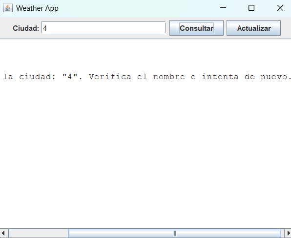
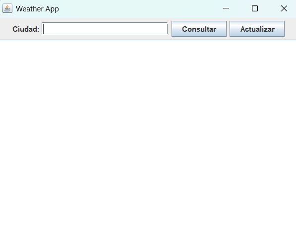
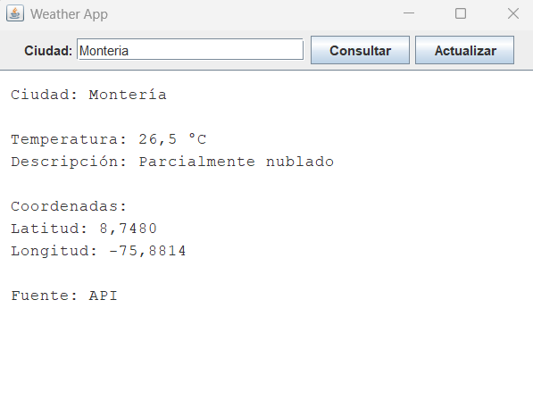

# WeatherApp 🌤

Aplicación de escritorio en Java 17 con interfaz gráfica (Swing) que permite consultar el clima actual de cualquier ciudad del mundo utilizando la API de Open-Meteo.
---

## Funcionalidades

- Consulta del clima actual de cualquier ciudad
- Conversión automática de ciudad a coordenadas geográficas
- Visualización de temperatura actual en grados Celsius
- Descripción textual del estado del clima
- Visualización de latitud y longitud de la ubicación consultada
- Sistema de caché para evitar llamadas repetidas a la API
- Botón de actualización para forzar consulta ignorando caché
- Manejo de errores para ciudades inválidas, fallos de API y problemas de red
- Interfaz gráfica desarrollada con Java Swing
- Pruebas unitarias con JUnit 5 y Mockito

---

## Requisitos

- Java 17 o superior
- Maven 3.8 o superior
- Conexión a internet (para consultar las APIs)

Verificar versiones instaladas:

```bash
java -version
mvn -version
```

---

## Instalación

**1. Clonar o descargar el proyecto:**

```bash
git clone https://github.com/VicR11/WeatherAppIA.git
cd WeatherAppIA
```

**2. Compilar con Maven:**

```bash
mvn compile
```

**3. Ejecutar las pruebas (opcional pero recomendado):**

```bash
mvn test
```

**4. Empaquetar en un JAR ejecutable:**

```bash
mvn package
```

---


## Uso

### Ejecutar desde Maven

```bash
mvn exec:java -Dexec.mainClass="org.weather.Main"

## Estructura del proyecto

```
WeatherApp/
├── pom.xml                          # Dependencias y configuración Maven
├── README.md
├── src/
│   ├── main/java/com/weather/
│   │   ├── Main.java                # Punto de entrada — lee input y muestra resultado
│   │   ├── model/
│   │   │   ├── WeatherData.java     # Objeto de respuesta (temperatura, descripción, coords)
│   │   │   └── Location.java       # Coordenadas intermedias (uso interno)
│   │   ├── api/
│   │   │   ├── GeocodingClient.java     # Ciudad → coordenadas (Open-Meteo Geocoding API)
│   │   │   ├── OpenMeteoClient.java     # Coordenadas → clima (Open-Meteo Forecast API)
│   │   │   └── WeatherCodeMapper.java   # Código WMO → descripción legible en español
│   │   └── service/
│   │   |   └── WeatherService.java  # Función principal — orquesta todo el flujo
|   |   |__ ui/
│   │   |    ├── WeatherGUI.java
│   │   |    └── WeatherFormatter.java
│   |   ├── cache/
│   │   └── WeatherCache.java
|   | 
│   └── test/java/com/weather/
│       ├── model/   WeatherDataTest.java
│       ├── api/     WeatherCodeMapperTest.java
│       │            GeocodingClientTest.java
│       │            OpenMeteoClientTest.java
│       └── service/ WeatherServiceTest.java
```

---

## APIs utilizadas

| API | Propósito | Requiere clave |
|-----|-----------|----------------|
| [Open-Meteo Geocoding](https://geocoding-api.open-meteo.com/v1/search) | Convierte nombre de ciudad en coordenadas | No |
| [Open-Meteo Forecast](https://api.open-meteo.com/v1/forecast) | Obtiene datos meteorológicos actuales | No |

Ambas APIs son gratuitas y de uso libre sin registro.


### Manejo de error

Ejemplo de mensaje mostrado cuando el usuario ingresa una ciudad inválida o no encontrada.



## Manejo de errores

La aplicación nunca lanza excepciones no controladas al usuario. Todos los errores se capturan y se devuelven como un JSON con la estructura:

```json
{
  "error": true,
  "message": "Descripción clara del problema"
}
```

| Situación | Comportamiento |
|-----------|----------------|
| Nombre de ciudad vacío o solo espacios | Error con mensaje orientativo al usuario |
| Ciudad que no existe en ninguna base de datos | Error indicando que no se encontró la ciudad |
| La API responde con código HTTP de error (4xx, 5xx) | Error indicando fallo temporal de la API |
| Sin conexión a internet | Error indicando problema de red |
| Fallo parcial (ciudad encontrada, clima no disponible) | Error sin devolver datos incompletos |

---

---
## Ejemplos de uso

### Interfaz principal

Pantalla inicial de la aplicación antes de realizar una consulta.



---

### Consulta exitosa

Ejemplo de consulta para una ciudad válida mostrando la información climática obtenida desde la API o desde caché.



---

### Manejo de error

Ejemplo de mensaje mostrado cuando el usuario ingresa una ciudad inválida o no encontrada.


## Pruebas unitarias

El proyecto incluye 20 casos de prueba organizados en 6 escenarios que cubren todos los caminos posibles de la función principal `getWeatherByCity()`.

```bash
# Ejecutar todas las pruebas
mvn test

# Ver reporte detallado
mvn test -Dsurefire.reportFormat=plain
```

Las pruebas no realizan llamadas reales a internet — usan objetos simulados (mocks) con Mockito, lo que las hace rápidas y predecibles.

| Escenario | Casos |
|-----------|-------|
| Entrada inválida (vacío, null, espacios) | 5 |
| Flujo exitoso completo | 6 |
| Ciudad inexistente | 3 |
| Fallo en geocodificación | 2 |
| Fallo al obtener el clima | 3 |
| Consistencia del objeto resultado | 3 |

---

## Posibles mejoras futuras

- **Soporte para múltiples ciudades en una sola ejecución** — permitir consultar varias ciudades sin reiniciar la aplicación.
- **Historial de consultas persistente** — guardar cada consulta en un archivo de log con fecha y hora para revisión posterior.
- **Unidades configurables** — permitir al usuario elegir entre Celsius, Fahrenheit y Kelvin.
- **Más variables meteorológicas** — agregar presión atmosférica, índice UV, velocidad de ráfagas de viento y punto de rocío.
- **Pronóstico extendido** — mostrar el clima de los próximos 7 días, no solo el actual.
- **API REST propia** — exponer la funcionalidad como un endpoint HTTP usando Spring Boot para que otras aplicaciones puedan consumirla.
- **Parseo de JSON con Jackson** — reemplazar el parseo manual de texto por la librería Jackson para mayor robustez y compatibilidad con cambios en la API.
- **Caché de consultas** — evitar llamadas repetidas a la API para la misma ciudad en un corto período de tiempo.
- **Internacionalización** — soporte para descripciones del clima en inglés, portugués y otros idiomas.

---

## Tecnologías

| Tecnología | Versión | Uso |
|------------|---------|-----|
| Java | 17 | Lenguaje principal |
| Maven | 3.8+ | Gestión de dependencias y build |
| JUnit 5 | 5.10.1 | Framework de pruebas unitarias |
| Mockito | 5.8.0 | Mocks para pruebas |
| Open-Meteo API | — | Datos meteorológicos (gratuita) |

---

## Licencia

Proyecto de uso educativo. Las APIs de Open-Meteo se usan bajo sus [términos de uso](https://open-meteo.com/en/terms) gratuitos.
